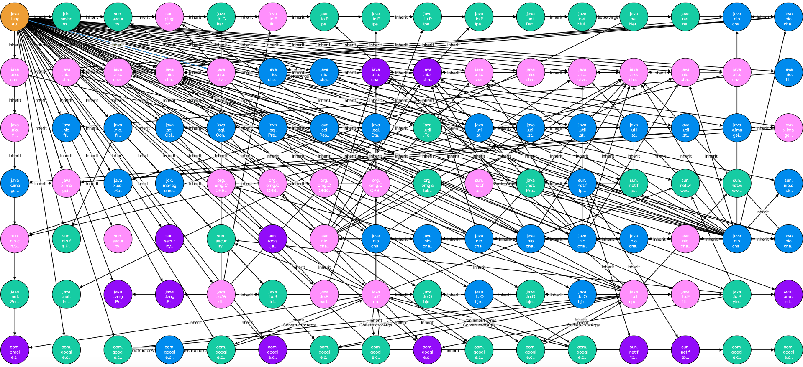

# Fastjson Auto Type Discovery and visualization

Blackhat USA 2021 Session ---- *How I Used a JSON Deserialization 0day to Steal Your Money on the Blockchain*

## Usage

The main entry is AutoTypeDiscovery.

Edit the first line at the static main function to set the jar file or directory you want to analyze.

Run , wait and get the output.

And data is saved to the cytoscape dir for visualization ( just for fun ;-) ). Open index.html in the browser.